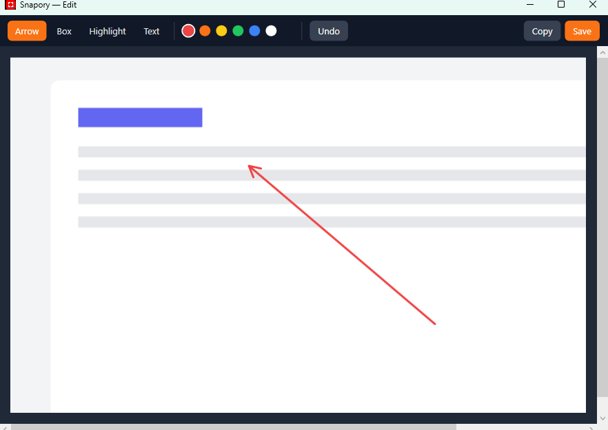

# Snapory

**English | [Türkçe](README.tr.md)**

A lightweight Windows screenshot and annotation tool.

Snapory lives quietly in your system tray. Press a hotkey, the screen freezes and
dims, you drag out the area you want — then it opens in a little editor where you
can add arrows, boxes, highlights, and text before copying it to the clipboard or
saving it as a PNG.

<p align="center">
  
</p>

## Features

- **Capture a region** — global hotkey (`Ctrl + Shift + S`) dims the screen and
  lets you drag out exactly the area you want.
- **Pixel-accurate** — captures from a frozen snapshot of the desktop, correct
  even on high-DPI and multi-monitor setups.
- **Annotate** — arrow, box, highlight, and text tools, in a choice of colours.
- **Undo** — step back through your annotations (`Ctrl + Z`).
- **Copy or save** — copy the result to the clipboard (`Ctrl + C`) or save it as
  a PNG (`Ctrl + S`), flattened at full resolution.
- **Start with Windows** — optional, toggled from the tray menu.
- **English & Turkish** — switch the interface language from the tray.
- **Private by design** — everything stays on your machine; nothing is uploaded.

## Run it

Snapory isn't published as a prebuilt download yet, so for now you run it from
source. You'll need the [.NET 8 SDK](https://dotnet.microsoft.com/download/dotnet/8.0)
(the SDK, not just the runtime) on Windows.

```bash
git clone https://github.com/volkanturhan/Snapory.git
cd Snapory
dotnet run --project Snapory/Snapory.csproj
```

Snapory starts quietly in the system tray — **no window pops up**. That's normal;
press the hotkey (or use **New screenshot** from the tray) to capture.

## How to use

1. Launch Snapory — it starts quietly in the system tray.
2. Press **`Ctrl + Shift + S`** (or pick **New screenshot** from the tray). The
   screen dims; **drag** to select the area you want. **Esc** cancels.
3. The selection opens in the editor. Pick a tool (**Arrow**, **Box**,
   **Highlight**, **Text**) and a colour, then draw on the image. **Undo** /
   **Ctrl + Z** removes the last mark.
4. **Copy** (`Ctrl + C`) puts the result on your clipboard; **Save** (`Ctrl + S`)
   writes a PNG.

Right-click the tray icon for **New screenshot**, **Start with Windows**,
language, and **Quit**.

## Build a shareable exe

Want a standalone `.exe` you can hand to someone without the SDK? Build it
yourself — the output isn't checked into the repo:

```bash
# Builds into dist/ (self-contained Snapory.exe + lite build)
pwsh tools/publish.ps1
```

## Tech

- C# / WPF on .NET 8 (Windows)
- No third-party dependencies

## License

MIT — see [LICENSE](LICENSE).
