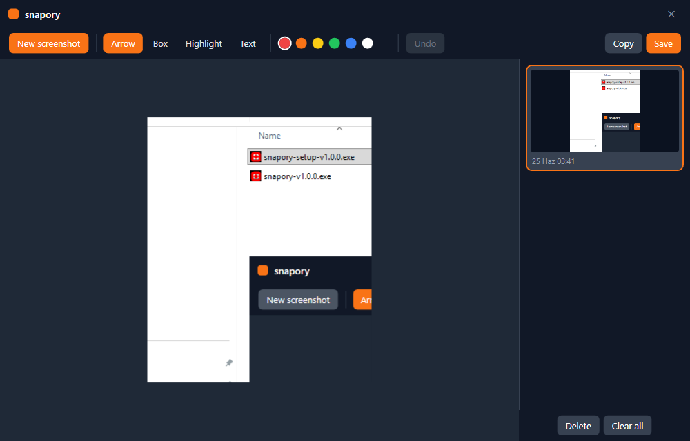
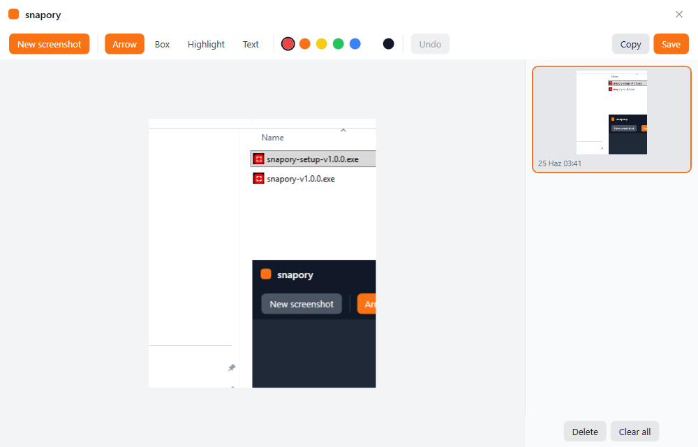

# snapory

**[English](README.md) | Türkçe**

Hafif bir Windows ekran görüntüsü ve işaretleme aracı.

snapory sistem tepsisinde sessizce durur. Bir kısayola basarsın, ekran donup
kararır, istediğin alanı sürükleyerek seçersin — sonra küçük bir editörde açılır;
panoya kopyalamadan ya da PNG kaydetmeden önce ok, kutu, vurgu ve yazı
ekleyebilirsin.

<p align="center">
  
  
</p>

## Özellikler

- **Bölge yakala** — global kısayol (`Ctrl + Shift + S`) ekranı karartır ve tam
  istediğin alanı sürükleyerek seçtirir.
- **Piksel hassasiyetinde** — masaüstünün donmuş anlık görüntüsünden yakalar;
  yüksek DPI ve çoklu monitör kurulumlarında bile doğru.
- **İşaretle** — ok, kutu, vurgu ve yazı araçları, farklı renk seçenekleriyle.
- **Geri al** — işaretlemelerinde geri adım (`Ctrl + Z`).
- **Kopyala ya da kaydet** — sonucu panoya kopyala (`Ctrl + C`) ya da PNG kaydet
  (`Ctrl + S`); tam çözünürlükte tek katmana indirgenir.
- **Tek pencere** — işaretleme tuvali ve geçmiş bir arada: görüntüler sağda alt
  alta, seçtiğin solda düzenlemeye açılır. Tek tek sil ya da tümünü temizle;
  geçmiş yeniden başlatınca da durur.
- **Koyu ya da açık** — menüden **Sistem**, **Koyu** ya da **Açık** temasını seç.
  Varsayılan **Sistem**, yani Windows ayarını takip eder.
- **Windows ile başla** — isteğe bağlı, menüden aç/kapa.
- **Kendini günceller** — yeni sürüm çıktığında snapory bunu tepsiden sunar; tek tıkla kurulur.
- **İngilizce & Türkçe** — arayüz dilini menüden değiştir.
- **Tasarımı gereği gizli** — her şey senin makinende kalır, hiçbir şey yüklenmez.

## İndir

En güncel sürümü [**Releases**](https://github.com/volkanturhan/snapory/releases/latest) sayfasından al:

- **snapory-setup-…exe** — kurulum (önerilen). Yönetici izni gerekmez ve snapory bundan sonra kendini güncel tutar.
- **snapory-…exe** — taşınabilir tek dosya; sadece çalıştır, kurulum yok.

İkisi de self-contained, yani .NET kurulu olması gerekmez. Windows 10/11, 64-bit.

## Kaynaktan çalıştır

Kendin derlemeyi mi tercih edersin? Windows'ta [.NET 8 SDK](https://dotnet.microsoft.com/download/dotnet/8.0)
(sadece runtime değil, SDK) kurulu olmalı.

```bash
git clone https://github.com/volkanturhan/snapory.git
cd snapory
dotnet run --project snapory/snapory.csproj
```

snapory sessizce sistem tepsisinde başlar — **hiçbir pencere açılmaz**. Bu
normaldir; yakalamak için kısayola bas (ya da tepsiden **Yeni ekran
görüntüsü**'nü kullan).

## Nasıl kullanılır

1. snapory'i başlat — sessizce sistem tepsisine yerleşir.
2. **`Ctrl + Shift + S`**'ye bas (ya da tepsiden **Yeni ekran görüntüsü**). Ekran
   kararır; istediğin alanı **sürükleyerek** seç. **Esc** iptal eder.
3. Görüntü snapory'nin penceresinde açılır — solda tuval, sağda geçmiş. Bir araç
   (**Ok**, **Kutu**, **Vurgu**, **Yazı**) ve renk seç, üzerine çiz. **Geri al** /
   **Ctrl + Z** son işareti kaldırır.
4. **Kopyala** (`Ctrl + C`) sonucu panoya koyar; **Kaydet** (`Ctrl + S`) PNG yazar.
   İkisi de görüntüyü geçmişte günceller.
5. Sağdaki herhangi bir küçük resme tıklayınca o görüntü düzenlemeye açılır;
   **Sil** seçileni kaldırır, **Tümünü temizle** geçmişi boşaltır.

Tepsi ikonuna sağ tık: **Yeni ekran görüntüsü**, **Aç** (pencere), **Windows ile
başlat**, dil ve **Çıkış**; tepsi ikonuna çift tıklamak da pencereyi açar.

## Kendin derle

Sürüm dosyalarını yerelde üretmek mi istiyorsun? Repoya dahil edilmezler:

```bash
# Taşınabilir self-contained exe + Windows kurulumu, dist/release içine.
# (Kurulum adımı Inno Setup ister: winget install JRSoftware.InnoSetup)
pwsh tools/release.ps1
```

## Teknoloji

- C# / WPF, .NET 8 (Windows)
- Üçüncü parti bağımlılık yok

## Lisans

MIT — bkz. [LICENSE](LICENSE).
